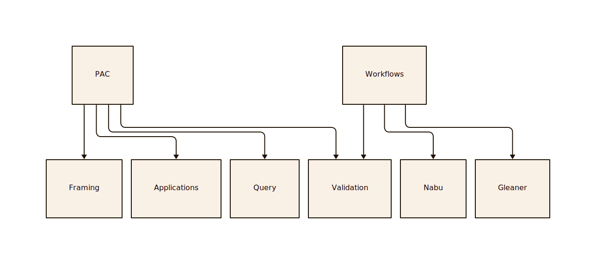

# Pattern Asset Catalog (PAC)

## PAC is

A simple JSON-LD (ie RDF) profile to describe a data graph that:

* Provides metadata about a SHACL shape (itself an RDF graph)
* related queries (SPARQL)
* related services associated with the above
* related JSON-LD frames
* connects the above to resolvable and established references of associated goals and patterns

The reason?

It is proposed that SHACL and some associated technology like framing
can help express some aspects of FAIR principles to this sector. This is an
exploration of that idea.

## PAC is NOT

This is NOT semantic integration.  It is not an ontology and does not provide any of the deep semantic
interoperability benefits that ontology and semantic integration based on ontologies can provide.

PAC is also NOT a new concept.  It is a influenced by. and attempts to borrow (steal) from, things such as
OGC STAC but also could be compared to things such as SQL global as view / local as view concepts.

Additionally, there are other projects such as WSMO  (https://www.w3.org/Submission/WSMO-primer/).

## Worth a 1000 words

##  Why not just?

### SPARQL in SHACL

While SHACL AF does allow some use of SPARQL including SELECT and ASK, this is a not more complex as the non-RDF
SPARQL is mapped into the SHACL.  Also, complex SPARQL seems like it would be at least annoying to do in this approach.
For now the model of connecting the SPARQL as an external creative work or other type is proposed.

### Put it all in one graph file

Given that both schema.org and SHACL build on the common RDF data model it would be just as easy (and one can)
integrate all this information into one file.   Why have two files holding the information?  Part of this is just
the simplicity of the abstraction as this concept is judged for value.  Blending the two files together
in some ways burdens the proven SHACL work with the ShaC hypothesis.

### SPARQL 1.1 Federates Search via Service?

However, while it is true this approach should allow SPARQL queries to be formed that 
can be federated via SERVICE, see [https://www.w3.org/TR/sparql11-federated-query/](https://www.w3.org/TR/sparql11-federated-query/)
for details, this is not the primary goal.  

Additional approaches would include being able to form SPARQL CONSTRUCT calls to form new 
triples or leveraging approach to subset or frame out data from a parent graph into 
a useful subset of triples for specific communities or use cases.  

Rather, the goal here is not to promote any given approach to use the graphs that validate 
to this common core shape, but simply ensure that whatever approach is developed works against the
shared graph shapes.

## PAC and principles like FAIR

What are the elements of FAIR we can encode into SHACL?  PIDs?  Vocabulary?
If not SHACL, VOID or some other way to describe?  schema.org?

Extend type Org to address FAIR?  Build off the RDA working group?

Or SDGs or essential variables

