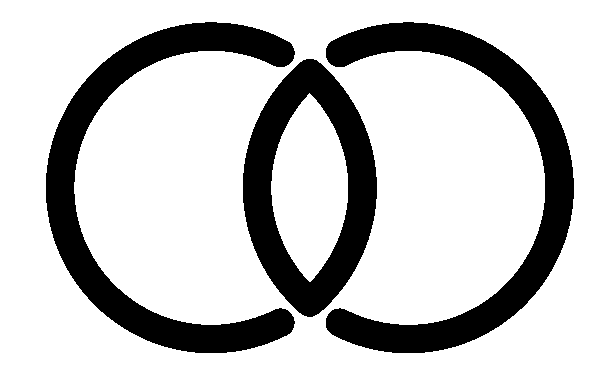

# Common Core

## About

A repository to explore developing guidance and validation around common graph shapes
to facilitate federated / distributed use of Knowledge Graphs.

## SPARQL 1.1 Federates Search via Service?

However, while it is true this approach should allow SPARQL queries to be formed that 
can be federated via SERVICE, see [https://www.w3.org/TR/sparql11-federated-query/](https://www.w3.org/TR/sparql11-federated-query/)
for details, this is not the primary goal.  

Additional approaches would include being able to form SPARQL CONSTRUCT calls to form new 
triples or leveraging approach to subset or frame out data from a parent graph into 
a useful subset of triples for specific communities or use cases.  

Rather, the goal here is not to promote any given approach to use the graphs that validate 
to this common core shape, but simply ensure that whatever approach is developed works against the
shared graph shapes.

## Initial approach

* Generate SHACL shapes for the various SPARQL queries used by groups involved in this work
* Provide approaches for the application of these SHACL shapes in in the triplestore or via tools like pySHACL
* Provide approaches for generating, sharing and reviewing the results of these validation processes

