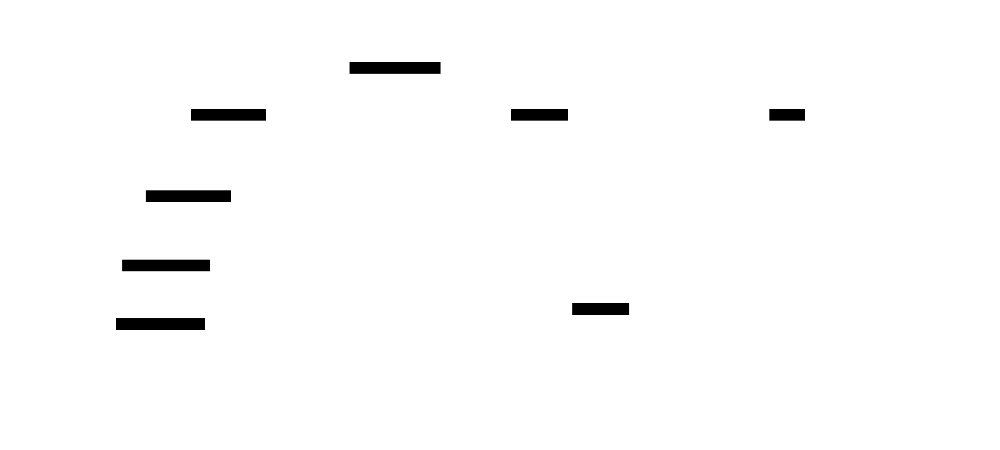
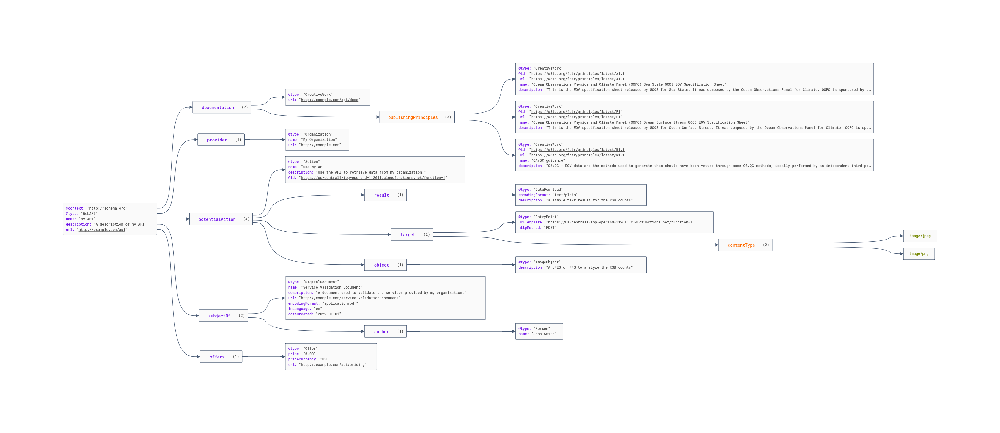

# Pattern Asset Catalogue (PAC)

## TLDR

* Create SHACL shapes
* generate schema.org to describe these shapes, and the principles and associated
SPARQL with them (things outside what the SHACL describes)
* harvest these SHACL and schema.org files into a KG
* use that to find the principles, associated vocabularies and shapes and queries
* perform or build queries and data integration

## About

The Shape Asset Catalog (ShAC) is a thought experiment inspired by the 
OGC [STAC specification](https://github.com/radiantearth/stac-spec).   The goal 
is to generate a simple schema.org based document that can:

* Describe a SHACL file
    * Point to where the SHACL file this
    * Point to a record that can be validated with the SHACL Profile
    * describe a command using something like pySHACL to do that validation

* The shapes relation to FAIR principles
    * [FAIR Implementation Profile](https://peta-pico.github.io/FAIR-nanopubs/fip/index-en.html)
    * [FAIR vocabulary](https://peta-pico.github.io/FAIR-nanopubs/principles/index-en.html)

* Example SPARQL based on the shape as a potential action
    * A document of that SPARQL
    * an endpoint with the SPARQL encoded in a GET call
    * describe the returns SELECTS of the SPARQL

* Describe the vocabularies used in the SHACL / SPARQL
* Describe the properties used? (why, just grab the SHACL and SPARQL query for those?)
* Describe the types it checks? (why, just grab the SHACL and SPARQL query for those?)

Given this SHAC catalog, it would be easy to collect these and form a KG of them.

Current thoughts on this are included in the two images below. 
An example implementation in JSON-LD can be found in the 
[pac.json](/pacGraphs/pac.json) file.

### Image 1

Draft idea on leveraging schema.org to describe a ShAC document.

### Image 2

Same as above but based on a reference JSON-LD document formed from the above. 

