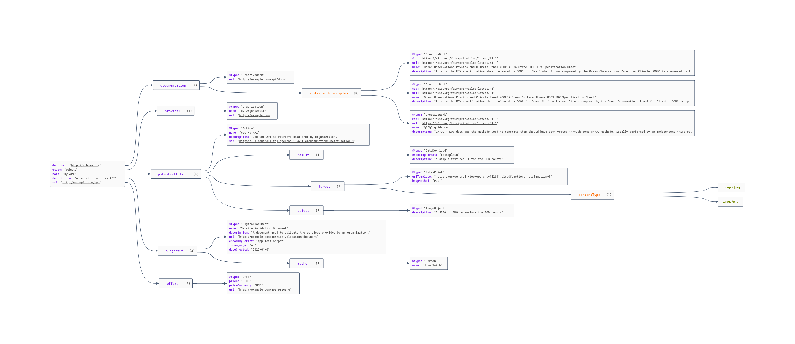

# Shape Asset Catalog (ShAC)

## About

The Shape Asset Catalog (ShAC) is a thought experiment inspired by the 
OGC [STAC specification](https://github.com/radiantearth/stac-spec).   The goal 
is to generate a simple schema.org based document that can:

1) Describe a SHACL file  
2) The shapes relation to FAIR principles
   3) [FAIR Implementation Profile](https://peta-pico.github.io/FAIR-nanopubs/fip/index-en.html)
   4) [FAIR vocabulary](https://peta-pico.github.io/FAIR-nanopubs/principles/index-en.html)
5) Example SPARQL based on the shape as a potential action

Current thoughts on this are included in the two images below. 
An example implementation in JSON-LD can be found in the 
[shac.json](/graph/shac.json) file.  

### Image 1

Draft idea on leveraging schema.org to describe a ShAC document.

### Image 2

Same as above but based on a reference JSON-LD document formed from the above. 

